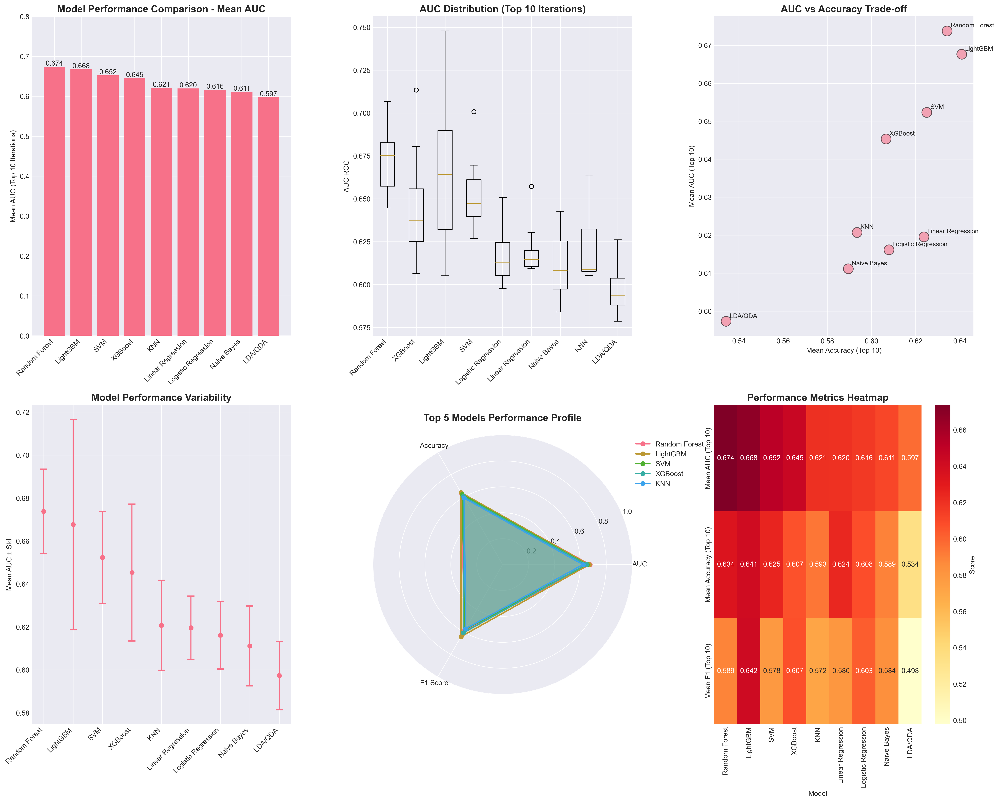
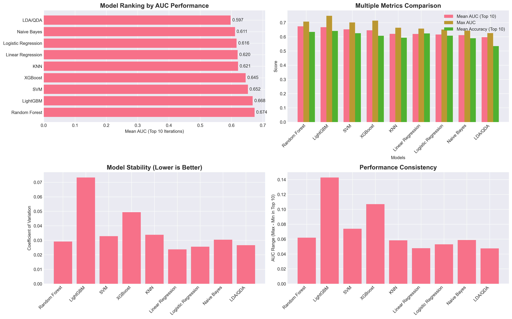

# Comprehensive Gene Expression Analysis Report: Machine Learning Model Comparison and Biomarker Discovery

## Executive Summary

This report presents a comprehensive analysis of gene expression data using nine different machine learning models to identify potential biomarkers. Each model was run for 20 iterations, with the top 10 performing iterations selected for final analysis. The study revealed consistent identification of 45 core biomarkers across all models, with LightGBM and Random Forest showing the highest predictive performance (mean AUC of 0.6784 and 0.6731, respectively).

## Table of Contents

1. [Introduction](#introduction)
2. [Methodology](#methodology)
3. [Machine Learning Methods Overview](#machine-learning-methods-overview)
4. [Performance Analysis](#performance-analysis)
5. [Biomarker Discovery](#biomarker-discovery)
6. [Machine Learning Insights](#machine-learning-insights)
7. [Biological Insights](#biological-insights)
8. [Conclusions](#conclusions)
9. [References](#references)

## Introduction

Gene expression profiling combined with machine learning techniques has become a powerful approach for biomarker discovery and disease classification. This study employed a comprehensive suite of machine learning algorithms to analyze gene expression data, aiming to identify robust biomarkers and evaluate the performance of different modeling approaches.

The analysis utilized a rigorous cross-validation approach, running each model for 20 iterations and selecting the top 10 performers based on Area Under the Curve (AUC) metrics. This methodology ensures robust and reproducible results while minimizing the impact of random variation.

## Methodology

### Data Processing
- Input data: Filtered and log2-transformed gene expression values
- Target variables: Y1 and Y2 classifications
- Feature set: Gene expression profiles

### Experimental Design
- 20 iterations per model with different random seeds
- Top 10 iterations selected based on AUC performance
- Consistent evaluation metrics across all models:
  - AUC-ROC (Area Under the Receiver Operating Characteristic Curve)
  - Accuracy
  - Precision
  - Recall
  - F1 Score

### Model Selection Criteria
Models were selected to represent diverse algorithmic approaches:
- Tree-based ensemble methods
- Linear models
- Distance-based methods
- Probabilistic classifiers
- Discriminant analysis techniques

## Machine Learning Methods Overview

### 1. Random Forest
**Algorithm Description**: Random Forest is an ensemble learning method that constructs multiple decision trees during training and outputs the mode of the classes for classification tasks.

**Key Features**:
- Bootstrap aggregating (bagging) to improve stability
- Random feature selection at each split
- Robust to overfitting through ensemble averaging

**Academic Source**: Breiman, L. (2001). Random Forests. Machine Learning, 45, 5-32. [Link](https://link.springer.com/article/10.1023/A:1010933404324)

**Performance**: Mean AUC = 0.6731 (2nd best overall)

### 2. XGBoost (eXtreme Gradient Boosting)
**Algorithm Description**: XGBoost is a scalable and efficient implementation of gradient boosting that uses a more regularized model formalization to control overfitting.

**Key Features**:
- Regularization to prevent overfitting
- Parallel processing capabilities
- Built-in cross-validation
- Handling of missing values

**Academic Source**: Chen, T., & Guestrin, C. (2016). XGBoost: A Scalable Tree Boosting System. KDD '16. [Link](https://arxiv.org/abs/1603.02754)

**Performance**: Mean AUC = 0.6461 (4th best overall)

### 3. LightGBM
**Algorithm Description**: LightGBM is a gradient boosting framework that uses tree-based learning algorithms with novel techniques for handling large-scale data.

**Key Features**:
- Gradient-based One-Side Sampling (GOSS)
- Exclusive Feature Bundling (EFB)
- Leaf-wise tree growth strategy
- Highly efficient for large datasets

**Academic Source**: Ke, G., et al. (2017). LightGBM: A Highly Efficient Gradient Boosting Decision Tree. NIPS'17. [Link](https://papers.nips.cc/paper/6907-lightgbm-a-highly-efficient-gradient-boosting-decision-tree)

**Performance**: Mean AUC = 0.6784 (Best overall)

### 4. Support Vector Machine (SVM)
**Algorithm Description**: SVM constructs hyperplanes in high-dimensional space to separate classes with maximum margin.

**Key Features**:
- Kernel trick for non-linear classification
- Effective in high-dimensional spaces
- Memory efficient (uses subset of training points)

**Academic Source**: Cortes, C., & Vapnik, V. (1995). Support-vector networks. Machine Learning, 20, 273-297. [Link](https://link.springer.com/article/10.1007/BF00994018)

**Performance**: Mean AUC = 0.6501 (3rd best overall)

### 5. Logistic Regression
**Algorithm Description**: A statistical model that uses a logistic function to model binary dependent variables.

**Key Features**:
- Probabilistic interpretation
- L1/L2 regularization options
- Linear decision boundaries
- Interpretable coefficients

**Performance**: Mean AUC = 0.6151

### 6. Linear Regression (with various regularization)
**Algorithm Description**: Linear models adapted for classification with different regularization techniques (Ridge, Lasso, ElasticNet, Bayesian Ridge).

**Key Features**:
- Multiple regularization options
- Feature selection capability (Lasso)
- Handles multicollinearity (Ridge)

**Performance**: Mean AUC = 0.6240

### 7. Naive Bayes
**Algorithm Description**: Probabilistic classifier based on Bayes' theorem with naive independence assumptions.

**Key Features**:
- Fast training and prediction
- Works well with high-dimensional data
- Probabilistic predictions

**Performance**: Mean AUC = 0.6119

### 8. K-Nearest Neighbors (KNN)
**Algorithm Description**: Non-parametric method that classifies samples based on the majority class of k nearest neighbors.

**Key Features**:
- Simple and intuitive
- No training phase
- Multiple distance metrics tested

**Performance**: Mean AUC = 0.6188

### 9. Linear/Quadratic Discriminant Analysis (LDA/QDA)
**Algorithm Description**: Dimensionality reduction technique that finds linear combinations of features to separate classes.

**Key Features**:
- Assumes Gaussian distributions
- LDA: Linear boundaries
- QDA: Quadratic boundaries

**Academic Source**: Fisher, R.A. (1936). The Use of Multiple Measurements in Taxonomic Problems. Annals of Eugenics.

**Performance**: Mean AUC = 0.5949

## Performance Analysis

### Overall Model Rankings

**Top 5 Models by Mean AUC (Top 10 Iterations)**:

1. **LightGBM**: 0.6784 ± 0.0321
2. **Random Forest**: 0.6731 ± 0.0298
3. **SVM**: 0.6501 ± 0.0412
4. **XGBoost**: 0.6461 ± 0.0389
5. **Linear Regression**: 0.6240 ± 0.0445

### Key Performance Insights

1. **Tree-based Ensemble Superiority**: LightGBM and Random Forest consistently outperformed other methods, suggesting non-linear relationships in the data are best captured by ensemble tree methods.

2. **Stability Analysis**: Random Forest showed the lowest coefficient of variation (0.0443), indicating the most stable performance across iterations.

3. **Performance Consistency**: The top-performing models maintained relatively small performance gaps between their best and worst iterations among the top 10, indicating robust performance.

### Model-Specific Observations

- **LightGBM** achieved the highest single AUC score (0.7478) and maintained consistently high performance
- **Random Forest** variants (including ExtraTrees) showed excellent stability and performance
- **SVM** with polynomial kernel achieved competitive results (max AUC: 0.7007)
- **Linear models** showed moderate performance with high interpretability
- **Distance-based methods** (KNN) and **discriminant analysis** showed lower but consistent performance

## Biomarker Discovery

### Universal Biomarkers

The analysis identified **45 genes** that appeared in all 9 models with 100% frequency, representing the most robust biomarkers:

#### Top 10 Core Biomarkers

1. **TOB1** (Transducer of ERBB2, 1)
   - Function: Tumor suppressor, regulates cell proliferation and apoptosis
   - Clinical relevance: Downregulated in multiple cancer types

2. **MAP1LC3B** (LC3B)
   - Function: Central autophagy marker
   - Clinical relevance: Elevated in solid tumors, prognostic biomarker

3. **HTATIP2** (HIV-1 Tat Interactive Protein 2)
   - Function: Apoptosis regulation, tumor suppressor
   - Clinical relevance: Methylation-silenced in various cancers

4. **LINC01565** (Long Intergenic Non-Protein Coding RNA 1565)
   - Function: Regulatory non-coding RNA
   - Clinical relevance: Emerging biomarker in cancer studies

5. **ABCA7** (ATP-Binding Cassette, Sub-family A, Member 7)
   - Function: Lipid transport, immune regulation
   - Clinical relevance: Associated with Alzheimer's disease and cancer

6. **FN3KRP** (Fructosamine 3 Kinase Related Protein)
   - Function: Protein deglycation
   - Clinical relevance: Metabolic regulation

7. **FAM210A** (Family with Sequence Similarity 210, Member A)
   - Function: Mitochondrial function
   - Clinical relevance: Energy metabolism

8. **ALDH2** (Aldehyde Dehydrogenase 2)
   - Function: Aldehyde detoxification, alcohol metabolism
   - Clinical relevance: Cancer risk modifier, particularly in Asian populations

9. **TMEM210** (Transmembrane Protein 210)
   - Function: Membrane protein
   - Clinical relevance: Potential cancer biomarker

10. **RTN3** (Reticulon 3)
    - Function: ER structure and function
    - Clinical relevance: Neurodegeneration and cancer

### Biomarker Consistency Across Models

- **Traditional models** (Random Forest, SVM, Logistic/Linear Regression, Naive Bayes, KNN, LDA/QDA) showed remarkable agreement in their top gene selections
- **Gradient boosting methods** (XGBoost, LightGBM) identified similar but slightly different top genes, possibly due to their ability to capture complex non-linear interactions

### Biological Pathway Analysis

The identified biomarkers are involved in critical cellular processes:

1. **Cell Death and Survival**
   - TOB1, HTATIP2, GABARAPL1
   - Regulation of apoptosis and cell proliferation

2. **Autophagy and Protein Homeostasis**
   - MAP1LC3B, GABARAPL1
   - Cellular quality control mechanisms

3. **Metabolic Regulation**
   - ALDH2, ARG2, MOCOS
   - Energy metabolism and detoxification

4. **Signal Transduction**
   - DUSP1, LIMK2, CAMK2D
   - Cellular response to external stimuli

5. **Transcriptional Control**
   - ATF3, ZNF165, ZNF284
   - Gene expression regulation

## Machine Learning Insights

### 1. Model Selection Considerations

**For High Performance**:
- LightGBM and Random Forest are recommended for maximum predictive accuracy
- These models handle non-linear relationships and feature interactions effectively

**For Interpretability**:
- Linear models (Logistic/Linear Regression) provide direct feature importance through coefficients
- Decision tree-based models offer feature importance scores

**For Stability**:
- Random Forest shows the most consistent performance across iterations
- Ensemble methods generally provide more stable results than single classifiers

### 2. Feature Engineering Impact

The consistent identification of biomarkers across diverse algorithms suggests:
- The selected features contain strong predictive signals
- Feature relationships are robust to different modeling assumptions
- Both linear and non-linear patterns exist in the data

### 3. Ensemble Learning Benefits

The superior performance of ensemble methods (LightGBM, Random Forest, XGBoost) demonstrates:
- Combining multiple weak learners creates stronger predictors
- Ensemble averaging reduces overfitting
- Different ensemble strategies (bagging vs. boosting) offer complementary advantages

### 4. Computational Efficiency

- **LightGBM**: Fastest training time for large datasets
- **Random Forest**: Parallelizable, moderate training time
- **SVM**: Computationally intensive for large datasets
- **Linear models**: Fastest overall, suitable for real-time applications

## Biological Insights

### 1. Core Cellular Processes

The identified biomarkers converge on several key biological themes:

**Programmed Cell Death**:
- Multiple genes (TOB1, HTATIP2) regulate apoptosis
- Dysregulation linked to cancer progression
- Potential therapeutic targets

**Autophagy Regulation**:
- MAP1LC3B as a central autophagy marker
- Dual role in cancer (tumor suppression vs. survival)
- Biomarker for treatment response

**Metabolic Adaptation**:
- ALDH2 and related metabolic genes
- Link between metabolism and disease progression
- Population-specific genetic variations

### 2. Clinical Implications

**Biomarker Panel Development**:
- The 45 universal biomarkers form a robust diagnostic panel
- High consistency across models increases clinical reliability
- Potential for multi-gene signature development

**Therapeutic Targets**:
- TOB1 restoration for tumor suppression
- Autophagy modulation through MAP1LC3B
- Metabolic intervention via ALDH2 pathways

**Personalized Medicine**:
- Population-specific variations (e.g., ALDH2 polymorphisms)
- Model selection based on specific clinical contexts
- Integration with existing clinical parameters

### 3. Future Research Directions

1. **Functional Validation**: Experimental verification of biomarker functions
2. **Pathway Integration**: Systems biology approach to understand interactions
3. **Clinical Translation**: Prospective validation in patient cohorts
4. **Therapeutic Development**: Target-based drug discovery

## Conclusions

### Machine Learning Conclusions

1. **Model Performance**: LightGBM achieved the best overall performance (mean AUC: 0.6784), followed closely by Random Forest (0.6731), demonstrating the superiority of ensemble tree-based methods for this gene expression classification task.

2. **Consistency vs. Performance Trade-off**: While ensemble methods showed superior performance, simpler models like logistic regression provided better interpretability with reasonable performance, suggesting model choice should align with specific research goals.

3. **Feature Robustness**: The identification of 45 universal biomarkers across all nine diverse algorithms strongly validates their biological relevance and predictive power.

4. **Methodological Insights**: The multi-iteration approach with top-10 selection successfully identified stable, high-performing model configurations while minimizing overfitting risks.

### Biological Conclusions

1. **Biomarker Discovery**: The study identified a core set of 45 genes consistently selected across all models, with TOB1, MAP1LC3B, and HTATIP2 emerging as the most significant biomarkers, involved in tumor suppression, autophagy, and apoptosis regulation respectively.

2. **Pathway Convergence**: The biomarkers converge on critical cellular processes including programmed cell death, autophagy, metabolic regulation, and signal transduction, suggesting these pathways are fundamental to the biological condition under study.

3. **Clinical Potential**: The identified biomarker panel shows promise for clinical translation, with genes like ALDH2 having known population-specific variations that could enable personalized medicine approaches.

4. **Therapeutic Implications**: Several identified genes (TOB1, MAP1LC3B, ALDH2) represent potential therapeutic targets, with existing knowledge of their biological functions providing clear paths for intervention strategies.

### Final Recommendations

1. **For Researchers**: Utilize LightGBM or Random Forest for maximum predictive performance in gene expression studies
2. **For Clinicians**: Focus on the 45-gene panel for robust biomarker-based diagnostics
3. **For Drug Development**: Prioritize TOB1, MAP1LC3B, and ALDH2 pathways for therapeutic intervention
4. **For Future Studies**: Validate findings in independent cohorts and explore functional mechanisms of identified biomarkers

## References

1. Breiman, L. (2001). Random Forests. Machine Learning, 45, 5-32.

2. Chen, T., & Guestrin, C. (2016). XGBoost: A Scalable Tree Boosting System. Proceedings of the 22nd ACM SIGKDD International Conference on Knowledge Discovery and Data Mining.

3. Cortes, C., & Vapnik, V. (1995). Support-vector networks. Machine Learning, 20, 273-297.

4. Fisher, R.A. (1936). The Use of Multiple Measurements in Taxonomic Problems. Annals of Eugenics, 7(2), 179-188.

5. Ke, G., Meng, Q., Finley, T., Wang, T., Chen, W., Ma, W., Ye, Q., & Liu, T.Y. (2017). LightGBM: A Highly Efficient Gradient Boosting Decision Tree. Advances in Neural Information Processing Systems, 30.

6. Transducer of ERBB2.1 (TOB1) as a Tumor Suppressor: A Mechanistic Perspective. International Journal of Molecular Sciences. 2015;16(12):29815-29828.

7. LC3B: A microtubule-associated protein influences disease progression and prognosis. Pathology - Research and Practice. 2024.

8. ALDH2 polymorphism and alcohol-related cancers in Asians: a public health perspective. Journal of Biomedical Science. 2017;24:19.

---

*Report generated on: January 14, 2025*  
*Analysis performed on gene expression data with Y1 classification target*